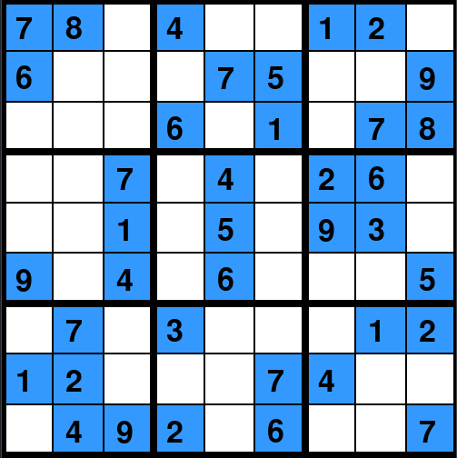
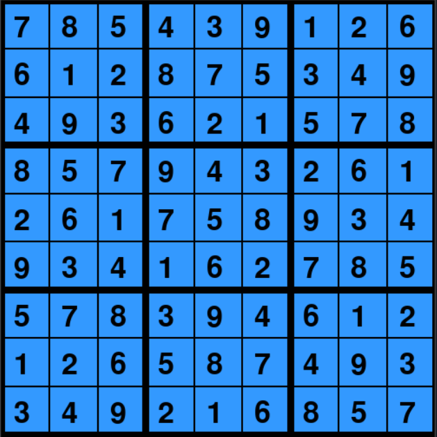

# sudoku-solver
I built a Sudoku solver with GUI using Pygame library.

### Introduction
Sudoku is a logic-based, combinatorial number-placement puzzle. In classic Sudoku, the objective is to fill a 9 × 9 grid with digits so that each column, each row, and each of the nine 3 × 3 subgrids that compose the grid (also called "boxes", "blocks", or "regions") contain all of the digits from 1 to 9. The puzzle setter provides a partially completed grid, which for a well-posed puzzle has a single solution. (Wiki)

### how it works?
The algorithm is based on backtracking.
Backtracking is a kind of brute-force approach to this problem, but the difference is that in backtracking we do not try all the possible combinations if not needed.
1. We find an empty cell on the board.
2. We try to fill the cell with numbers(from 1-9) incrementally.
3. If this does not violate any rule we keep moving to the next empty cell.
4. If no number can be assigned to this cell we leave it empty and go back to the previous cell to try another number.

#### the algorithm in action using Pygame:

https://user-images.githubusercontent.com/90900617/187201998-439c92a5-2838-454c-a99a-ef23f929126e.mp4

